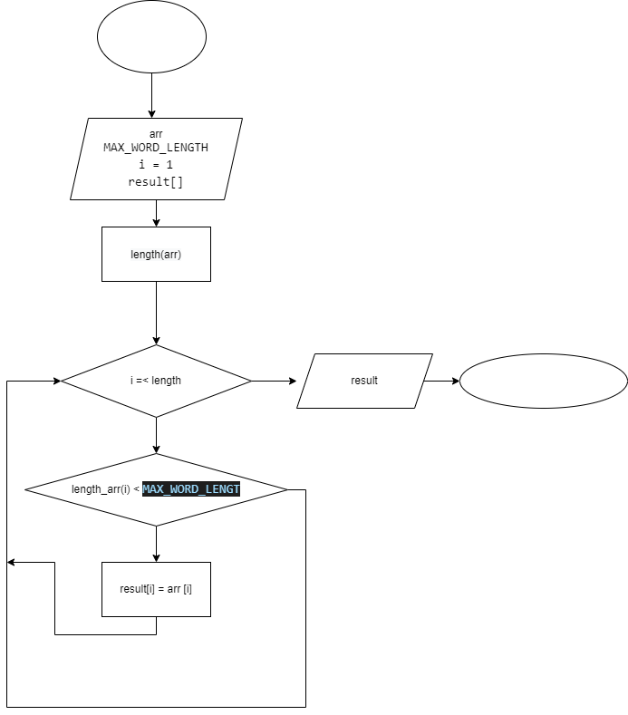

## Задача:
Написать программу, которая из имеющегося массива строк формирует массив из строк, длина которых меньше либо равна 3 символа. Первоначальный массив можно ввести с клавиатуры, либо задать на старте выполнения алгоритма. При решение не рекомендуется пользоваться коллекциями, лучше обойтись исключительно массивами.

Алгоритм решения представлен на диаграмме:

 

Представленное решение повторяется трижды для разных значений массива (*arr1*, *arr2*, *arr3*)